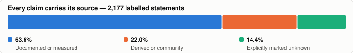

# Loxone Config skill for Claude — Smartmacherei

**Stops Claude from guessing about Loxone.** Without this skill, an AI assistant will
happily invent a block type, pick the wrong connector, or tell you a parameter exists
that doesn't. This skill replaces that with looked-up answers — and marks every single
claim with where it came from.

Content is in German, the language of the official Loxone documentation it was verified
against. Verified as of **Loxone Config 17.2.8.28**.

---

## What it changes

Four real examples of what the skill answers, and what goes wrong without it.

### "Config refuses to open my file and gives no reason"

> `Document/@NumO` must be **exactly** the number of `<C>` elements in the file.
> If it doesn't match, Config says *"Das aus dem Miniserver geladene Projekt hat einen
> fehlerhaften Inhalt!"* — even for an ordinary file open. **No logfile, no detail
> message.** Verified on generated projects: rejected with `NumO="2240"` at 183 objects,
> and correcting `NumO` alone made the same file open again.

The skill also lists what this check does *not* complain about, so you don't spend hours
searching in the wrong direction.

### "Which connector do I wire the state to?"

> `InputRef.AQ` is the state. `InputRef.Q` is the **error output**.
>
> ```
> AI  <=  Source.Q    (state)   ->  AQ  = state      <- use this one
> I   <=  Source.Qe   (ERROR)   ->  Q   = error
> ```
>
> Exception: references to a `Memory` use `.Q`.

Get this wrong and the project still loads. It just never works, and nothing tells you why.

### "Customer has a Huawei inverter — where do I start?"

> Look it up before typing a single Modbus register. The skill ships a searchable
> catalogue of **all 735 integrations** in the Loxone Library:
>
> ```
> 13,400+  HUAWEI SUN2000 Inverter & LUNA2000 battery   Modbus
> ```
>
> ```bash
> curl -L -o X.LxAddon https://api.library.loxone.com/downloader/config/<slug>
> ```
>
> 448 of the 735 entries are Modbus. But only **33 are certified** — so check `cert`,
> `dl` and `by` before recommending one, and always change the address after import:
> every template carries the submitter's IP.

### "Storm protection for window motors"

> `Wap` (wind-alarm position) defaults to **0 = fully OPEN**.
>
> Correct for blinds and venetians — raised is wind-safe. **Fatal for window motors:**
> they tear open in a storm. Set `Wap = 1` there.

That default has a good reason and a dangerous edge case. The skill tells you both.

---

## Every claim carries its source

This is the part that matters. Anything an AI tells you about a niche product is
worthless unless you can tell *documented fact* from *plausible guess*. So every
statement in this skill is labelled — **2,177 of them**:

<picture>
  <source media="(prefers-color-scheme: dark)" srcset="docs/evidence-dark.svg">
  
</picture>

| Label | Count | Meaning |
|---|---:|---|
| `[BELEGT]` | 1,215 | verbatim from the official Loxone knowledge base, source URL included |
| `[ABGELEITET]` | 417 | reasoned — **documented nowhere**. Check before safety-relevant use |
| `[OFFEN]` | 313 | unknown, and deliberately not guessed |
| `[BELEGT-TECHDOC]` | 120 | from Loxone's own machine-readable block documentation |
| `[COMMUNITY]` | 63 | LoxWiki / Loxforum — not official |
| `[VERIFIZIERT]` | 45 | measured on a real system, with the date |
| `[PROJEKT-BELEGT]` | 4 | observed in a specific project file |

**The 313 `[OFFEN]` entries are the point.** A source that never admits ignorance can't be
trusted where it does claim certainty.

---

## What's inside

37 reference documents, 7 scripts, about 18,700 lines.

| Area | What you get |
|---|---|
| **Block catalogue** | All 179 blocks of the official KB plus 20 from Loxone's TechDoc — inputs, outputs, parameters verbatim, with documented pitfalls |
| **File format** | `.Loxone` XML: lossless editing, PowerShell recipes, and the traps — including one that **silently destroys PicoC programs** without any checksum noticing |
| **Third-party devices** | All 735 Loxone Library integrations as a searchable catalogue, the `.LxAddon` format decoded, the open JSON API |
| **Peripheral XML** | Modbus, RS232/485, HTTP/UDP inputs, IR — attribute sets derived from 176,850 real occurrences in 701 templates |
| **Miniserver access** | Read and write the program over FTP, push terminal values out over UDP in real time, Gateway/Client setups |
| **Networking** | Every port and domain Loxone uses; why Air devices go offline and stay offline for up to 24 hours |
| **Audio & Sonos** | The four ways to attach Sonos, honestly ranked — including what Loxone itself ships and what it can't do |

### Scripts

`decode_lxres.py` reads Loxone's own block documentation out of the Config package ·
`library_crawl.py` refreshes the Library catalogue · `ha_udp_logger.py` wires terminals
to a UDP listener · `bacnet_probe.py` checks BACnet without YABE · plus TechDoc diffing
and project inventory tools.

---

## Install

Copy this folder to your Claude skills directory so that `SKILL.md` sits at:

- Windows: `%USERPROFILE%\.claude\skills\loxone-config\SKILL.md`
- macOS / Linux: `~/.claude/skills/loxone-config/SKILL.md`

Restart Claude Code (or reload skills). The skill triggers automatically when you work
with `.Loxone` files or ask what a Loxone block can do — or invoke it with
`/loxone-config`.

Some references read files from a local Loxone Config installation
(`C:\ProgramData\Loxone\Loxone Config <version>\`). Everything else works without it.

## Updates

New versions are announced to subscribers of the "Loxone skill" topic:
https://smartmacherei.at/en/downloads

## Licence

Free to use and modify. No warranty. Block documentation is paraphrased from the public
Loxone documentation; Loxone is a trademark of Loxone Electronics GmbH, which is not
affiliated with this skill.

---

Smartmacherei e.U. · Ing. Thomas Basting · Gnadlingerweg 11, 4650 Edt bei Lambach, Austria
office@smartmacherei.at · https://smartmacherei.at
